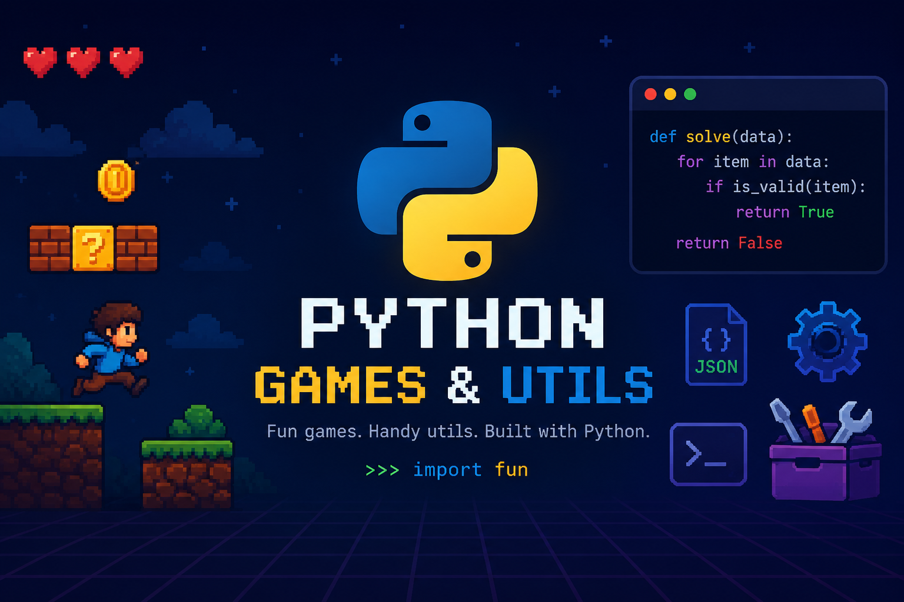

# 🎮 Helobro3



## 🎯 Projects Currently Available

### 🐍 Snake Game (`SnakeGame.py`)
A graphical Snake game using the `turtle` module.

**Features:**
- Use arrow keys to control the snake
- Eat yellow food to grow and score points
- Avoid hitting walls or yourself
- Grid-based movement for smooth gameplay
- Fun red tongue that follows your direction
- Sound effects on food collection (Windows) or console feedback (other OS)
- Score display at the top of the screen
- Auto-reset when you crash

**Requirements:**
- `turtle` module (built-in with Python)
- Optional: `winsound` (Windows only, for sound effects)

**How to Play:**
run the code in your python executor or console panel

- Use **Up**, **Down**, **Left**, **Right** arrow keys to move
- Press **Ctrl+C** to exit

---

### 🪙 Coin Flip Game (`CoinFlipGame.py`)
A simple interactive coin flip game with score tracking.

**Features:**
- Flip a virtual coin as many times as you want
- Track Heads vs. Tails count
- Clean, simple interface
- Easy to stop with Ctrl+C

**How to Play:**
run the code in your python executor or console panel

- Press **Enter** to flip the coin
- Watch your running score
- Press **Ctrl+C** to stop and exit

---

## 💻 Requirements

- Python 3.x
- Built-in modules only (no external packages needed)

## 🚀 Getting Started

1. **Clone the repository:**
   ```bash
   git clone https://github.com/Actusis-Nricul/helobro3.git
   cd helobro3
   ```

2. **Run a game:**
   ```bash
   python SnakeGame.py    # For the Snake game
   python CoinFlipGame.py # For the Coin Flip game
   ```

## 📝 License

This project is open source and free to use.
With apache license v2
## 🤝 Contributing

Feel free to fork this repository and add more games or improve existing ones!

---

**Have fun! 🎉**
